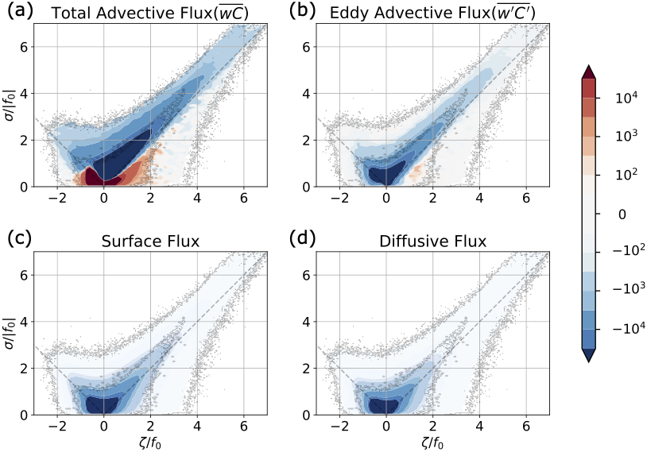

## Vertical fluxes conditioned on vorticity and strain reveal submesoscale ventilation
### Dhruv Balwada, Qiyu Xiao, Shafer Smith, Ryan Abernathey & Alison R. Gray 
### January 2021
### Submitted to Journal of Physical Oceanography

   

**Abstract**  
It has been hypothesized that submesoscale flows play an important role in the vertical transport of climatically important tracers, due to their strong associated vertical velocities. However, the multi-scale, non-linear and Lagrangian nature of transport makes it challenging to attribute proportions of the tracer fluxes to certain processes, scales, regions or flow features.
Here we show that the surface vorticity and strain joint probability distribution function (JPDF) effectively decomposes the surface velocity field into distinguishable flow features like fronts and eddies. 
The JPDF has a distinct shape, which is at least partially determined by  different flow instabilities. 
Further, this diagnostic approach approximately parses the flow into different scales, as stronger velocity gradients are usually associated with smaller scales. Conditioning the vertical tracer transport on the vorticity-strain JPDF can therefore help to attribute the transport to flow features and scales.
Applied to a set of idealized Antarctic Circumpolar Current simulations that vary only in horizontal resolution, this diagnostic approach demonstrates that submesoscale fronts, despite their minuscule spatial footprint, play an outsized role in exchanging tracers across the mixed layer base and are an important contributor to the large scale tracer budgets.

**Reproduction Notes**  
This repository has all the jupyter notebooks needed to do the analysis presented in this paper, and reproduce the figures. 

All the analysis for the paper can be done on google cloud [Abernathey et al 2021](https://www.authorea.com/doi/full/10.22541/au.160443768.88917719/v2). The data for the 10 day snapshot are at: https://catalog.pangeo.io/browse/master/ocean/channel/ . The analysis for section 3b requires access to daily snapshot data, which not on the cloud. Users can contact us if they would like access to it. 

